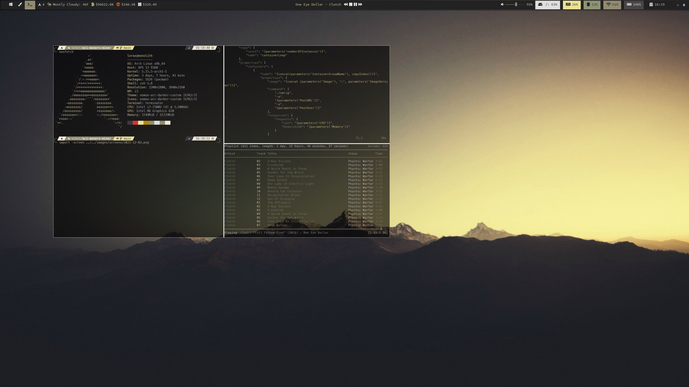

# Configuration files for my Linux desktop



## Components

Window Manager - [i3-gaps](https://i3wm.org/)  
Taskbar - [Polybar](https://github.com/polybar/polybar)  
Shell - [zsh](https://zsh.sourceforge.io/)  
Terminal - [Terminator](https://terminator-gtk3.readthedocs.io/en/latest/preferences.html)  
[OhMyZsh](https://ohmyz.sh/)  
Zsh Theme - [powerleve10k](https://github.com/romkatv/powerlevel10k)  
Music Player Daemon - [mopidy](https://mopidy.com/)  
Music Player Client - [ncmpcpp](https://github.com/ncmpcpp/ncmpcpp)

Custom Tickers:  
Weather  
BTC-->USD Price  
XMR-->BTC Price  
USD Stock price quote

## Requirements

[yfinance](https://pypi.org/project/yfinance/)  
[jq](https://stedolan.github.io/jq/)  
[FontAwesome](https://fontawesome.com/)  
[Nerd Fonts](https://github.com/ryanoasis/nerd-fonts)  
[feh](https://feh.finalrewind.org/)  
[blueman](https://github.com/blueman-project/blueman)  
xcompmgr - xorg package for xwindow composition  

stockticker.sh calls ticker.py and returns market price.  Just pass in the symbol as the first argument

```bash
stockticker.sh MSFT
```
